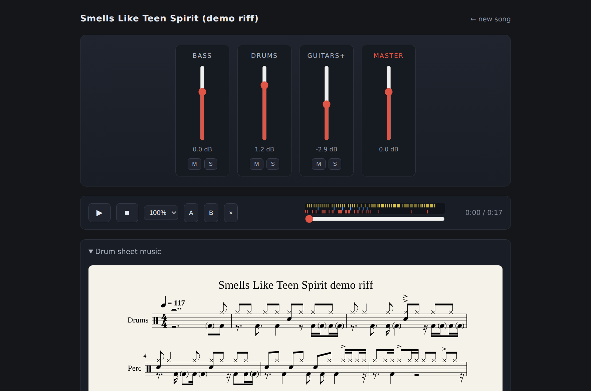
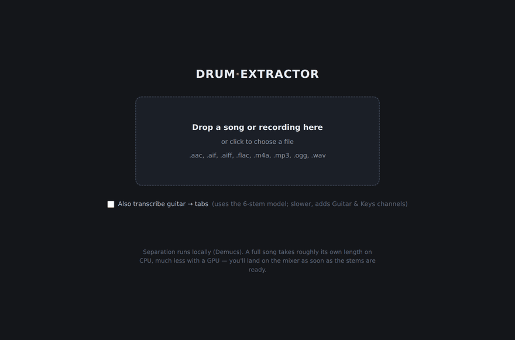
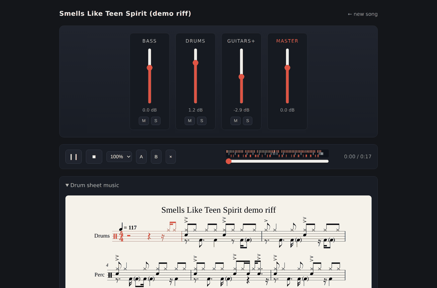
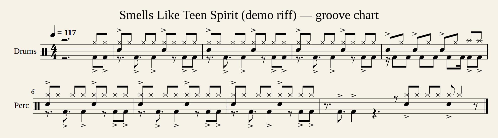

# 🥁 Drum Extractor

**Drop in a metal, punk, or rock song → get the isolated drums and bass, a
mixer to practice with, and auto-generated drum sheet music.**

[](https://github.com/Ben-K-Jordan/Drum-Extractor/actions/workflows/ci.yml)
[](LICENSE)
[](pyproject.toml)

Everything runs **locally** — your audio never leaves your machine.



## What it does

- **Splits any song into stems** (drums / bass / vocals / guitars) with
  [Demucs v4](https://github.com/facebookresearch/demucs), the open-source
  state of the art — on dense, distorted mixes included.
- **Mixer-board web UI**: a fader per stem with mute/solo, so you can drum
  along with the band minus the drummer, or isolate the kit to learn it.
- **Practice tools**: slow playback to 50% *with pitch preserved*, an A–B loop
  for drilling one riff or fill, and a **hit-marker strip** showing every
  detected drum hit on the timeline (click to jump).
- **Drum sheet music**: transcribes the drum stem to MIDI and engraves it —
  shown inline on the mixer page **with the current measure highlighted as the
  song plays**, downloadable as PDF/MusicXML/MIDI. Dynamics survive: ghost
  notes engrave parenthesized, accents get accent marks.
- **Bass tabs**: note transcription plus a playable ASCII tab (chord-aware —
  double-stops land on separate strings).
- **Guitar tabs (optional)**: tick "also transcribe guitar" and the 6-stem
  model adds Guitar & Keys channels plus a separate chord-aware guitar tab.
  Honest caveat: clean/lead guitar transcribes usefully; high-gain rhythm
  guitar is the hardest signal there is — treat those tabs as a first sketch.
- **Guitar Pro export**: bass and guitar tabs also save as `.gp5` (opens in
  Guitar Pro, TuxGuitar, MuseScore — with playback).
- **A real library**: processed songs survive server restarts and are listed
  on the drop page; separation shows live percent progress while you wait.
- **Download your mix**: the stem levels you set render straight to a WAV in
  the browser.

## The 30-second tour

| Drop a song in… | …then practice with it |
|---|---|
|  |  |

Everything above is real output. The demo song is a **synthesized rendition
of the classic *Smells Like Teen Spirit* four-chord riff** (F5–B♭5–A♭5–D♭5 at
117 BPM), generated by `examples/demo_riff.py` — run it yourself for an
instant test song plus every artifact the pipeline produces, no copyrighted
audio involved. The demo drums follow the transcribed groove: the kick pair
on 1 and the "&" of 1 into the backbeat, syncopated kicks on the "a" of 2 and
the "&" of 3, straight-8th hats (crash wash in the back half), and the
flammed snare/kick/hat entrance fill leading into the crashes.

This is the bass tab the pipeline wrote for that riff. Nobody told it the
fingering — the chord-aware assigner lands on the classic shape by itself
(F and B♭ at the 1st fret, A♭ and D♭ at the 4th):

```text
== Smells Like Teen Spirit (demo riff) — bass ==
tuning: E1 A1 D2 G2 (low to high)   tempo: ~117 BPM

G|-------------------------------------------------------------------------
D|-------------------------------------------------------------------------
A|-----1--1--1-----4--4--4--------1--1--1-----4--4--4-----1--1--1-----4--4-
E|--1-----------4-----------1--1-----------4-----------1-----------4-------
```

The same notes also land in `bass.gp5` (opens in Guitar Pro / TuxGuitar,
with playback) and `bass.mid`. And this is the demo groove engraved by the
notation stage (from the demo's known hits — `reference.musicxml`; on a real
song the same engraver renders the *transcriber's* draft instead, which is
what shows inline on the mixer, synced to playback):



## Quick start

**One line** (macOS / Linux) — installs to `~/drum-extractor`, pre-downloads
the model, launches the app, and opens your browser:

```bash
curl -fsSL https://raw.githubusercontent.com/Ben-K-Jordan/Drum-Extractor/main/bootstrap.sh | bash
```

Relaunch any time with `~/drum-extractor/run.sh` (macOS users also get a
double-clickable **Drum Extractor.command**).

**Docker** — no clone, no Python:

```bash
docker run -p 8237:8237 -v drumx-output:/app/output ghcr.io/ben-k-jordan/drum-extractor
```

**Windows** — clone the repo, double-click `install.bat`, then `run.bat`.

Then drop a song in at **http://127.0.0.1:8237** (the browser opens by
itself outside Docker). Separation takes roughly the length of the track on
CPU, much less with a GPU.

<details>
<summary><strong>Manual install / picking your own pieces</strong></summary>

```bash
git clone https://github.com/Ben-K-Jordan/Drum-Extractor.git && cd Drum-Extractor
./install.sh                   # scripted: venv + extras + launchers + checkup
# or fully by hand:
python3 -m venv .venv && source .venv/bin/activate
pip install -e ".[all]"        # separation + transcription + notation + web UI
drum-extractor doctor          # shows what's ready and how to fix any gaps
```

Pick-and-choose extras if you don't want everything: `[separation]` `[drums]`
`[bass]` `[notation]` `[web]` — each stage degrades gracefully when its
dependencies are absent, and error messages always name the exact install
command.

**Optional upgrades**

| What | Why | How |
|---|---|---|
| **ADTOF** | The best open drum transcriber (trained on rock/metal) — without it a rough built-in fallback is used | `pip install -e ".[adtof]"` |
| **MuseScore 4** | PDF sheet export (MusicXML works without it) | [musescore.org](https://musescore.org), CLI on PATH |
| **madmom** | Bar-accurate downbeat tracking (librosa fallback otherwise) | `pip install -e ".[quantize]"` — its old build chain can fail on modern Python, which is why it's not in `[all]` |
| **audio-separator** | Blend a second drum model with Demucs (`--ensemble-model`) | `pip install -e ".[ensemble]"` — its strict dependency pins can fight the rest of the stack, which is why it's not in `[all]` |

**Docker, built locally** (instead of the prebuilt `ghcr.io` image):

```bash
docker build -t drum-extractor .
docker run -p 8237:8237 -v drumx-output:/app/output drum-extractor
```

</details>

Not sure what's installed? **`drum-extractor doctor`** prints a checkup of
every feature with the exact fix for anything missing.

## Command line

The web UI is the easy path; everything is also scriptable:

```bash
drum-extractor run song.mp3                    # full pipeline -> output/song/
drum-extractor separate song.mp3               # stems only
drum-extractor transcribe-drums stems/drums.wav
drum-extractor notate output/song/transcription.json
drum-extractor run song.mp3 --grid 32 --boost-double-kick   # fast-metal setup
drum-extractor run song.mp3 --guitar                        # + guitar tabs (6-stem model)
drum-extractor run song.mp3 --fixed-tempo 184 --grid-mode constant  # you know the BPM
drum-extractor run song.mp3 --reuse-stems --drum-backend adtof      # re-transcribe, skip separation
```

`output/<song>/` contains the stems, `drums.mid`, `bass.mid`, `bass.tab.txt`,
`drums.musicxml` (+ `drums.pdf` with MuseScore), a `drums_sonified.wav` you can
A/B against the stem by ear, and `transcription.json` (re-notate any time
without re-processing).

## How it works

| Stage | Tool | License |
|---|---|---|
| Source separation | [Demucs v4](https://github.com/facebookresearch/demucs) `htdemucs_ft` | MIT |
| Drum transcription | [ADTOF](https://github.com/MZehren/ADTOF) (via [ADTOF-pytorch](https://github.com/xavriley/ADTOF-pytorch)), with a built-in onset fallback | non-commercial* |
| Bass transcription | [basic-pitch](https://github.com/spotify/basic-pitch) + [torchcrepe](https://github.com/maxrmorrison/torchcrepe) | Apache-2.0 / MIT |
| Beat tracking | [madmom](https://github.com/CPJKU/madmom) or [librosa](https://github.com/librosa/librosa) | BSD / ISC |
| Engraving | [music21](https://github.com/cuthbertLab/music21) → MusicXML → [verovio](https://github.com/rism-digital/verovio) SVG / [MuseScore](https://musescore.org) PDF | BSD / LGPL / GPL |

\* ADTOF's weights are CC BY-NC — fine for personal practice; swap in
OaF-Drums (Apache-2.0) if you need a commercial-safe chain. This project's own
code is MIT.

Extras for fast metal: a **double-kick booster** (`--boost-double-kick`)
recovers blast-tempo kicks from the low band that full-kit models merge
(measured: kick recall 0.67 → 0.98 at 200 BPM), and an optional **two-model
drum ensemble** with UVR-style spectral blending cuts distorted-guitar bleed.

## What to expect (honest version)

- **Stem separation is the solved half.** Drums come out clean even from dense
  metal mixes; bass is clearly usable, though down-tuned distorted bass loses
  some character.
- **Sheet music is a draft, not gospel.** A mid-tempo groove transcribes into
  a genuinely useful chart. Fast metal — blast beats, 200+ BPM double-kick,
  dense cymbal work — comes out as a scaffold you correct by ear; that's the
  current limit of *every* transcription tool, commercial ones included. The
  `drums_sonified.wav` render exists exactly for that by-ear checking.
- Cymbal/tom identity is the weakest area of automatic transcription;
  kick/snare/hi-hat are the reliable core.

## Accuracy is measured, not hoped for

The repo ships a **ground-truth groove bank**: programmatically generated
grooves (d-beat, blasts, gallops, fills…) rendered by a built-in synthesizer,
so the true hits are known and any transcriber can be scored with real
F-measures:

```bash
drum-extractor bank-build -o bank
drum-extractor bank-eval bank --backend onset   # or: --backend adtof
```

CI runs the full test suite **and this accuracy gate** on every push — a
change that degrades transcription fails the build. The tuning story (including
an overfitting mistake the process itself caught) is in
[docs/development.md](docs/development.md), along with the full QA history:
every module was adversarially audited and diffed against its upstream
project's real source.

## Contributing / development

```bash
./install.sh --light          # no torch/TF stacks: drums, notation, web, gp5
.venv/bin/pytest -q           # 150 tests, no GPU or model downloads needed
```

Issues and PRs welcome — especially real-world reports of where transcription
falls down on your songs, and hand-corrected charts (each becomes an (audio,
ground-truth) pair the bank can score against).

## Credits

Standing on the shoulders of [Demucs](https://github.com/facebookresearch/demucs),
[ADTOF](https://github.com/MZehren/ADTOF), [basic-pitch](https://github.com/spotify/basic-pitch),
[torchcrepe](https://github.com/maxrmorrison/torchcrepe), [librosa](https://librosa.org),
[madmom](https://github.com/CPJKU/madmom), [music21](https://web.mit.edu/music21/),
[verovio](https://www.verovio.org) and [MuseScore](https://musescore.org).
